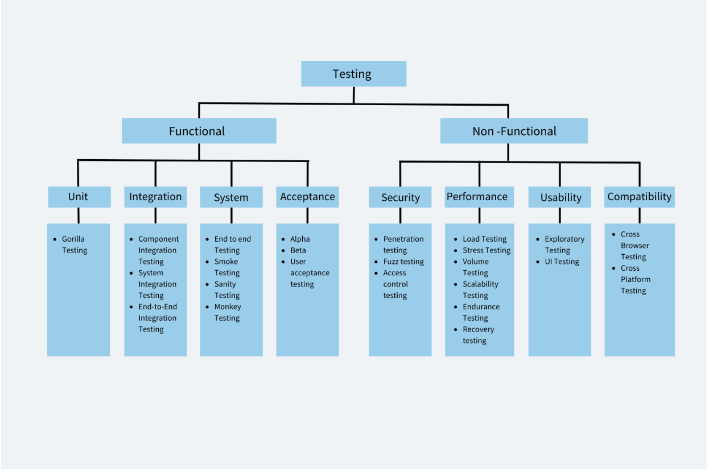

# Testing

Various ways and angles to verify any software to ensure its functionality and or appearance.

## Techniques

### Black Box

Checks software functions without a clew of internals. **Intent**, find performance errors, missing functions and glitches.

### White Box

**Intent**, analyze systems when running unit, integration and system testing.

### Functional

- #### Unit tests

Tests at component level

- #### Integration tests

Tests that check that components behave well together

- #### System tests

All elements are tested for overall functionality

- #### Acceptance tests

Tests in the hand of potential users and note their feedback

### Non Functional

- #### Performance tests

  Testing efficiency and resiliency to handle traffic

- #### Compatibility tests
  Compatible with browsers, mobile, desktop, OS
- #### Security tests

  Tests from hacker POV, unauthorized access

- #### Usability tests

  Testing usage without hassle to the users

- #### Visual tests

  Check if UIU elements rendered as expected

- #### Accessibility tests

  Tests for accessibility

- #### Responsive tests

  Tests if the site renders well on different screen sizes.

  ## Best Practices

  - Formal plan thats created with input from all stakeholders
  - Test as early as possible
  - Use automation testing
